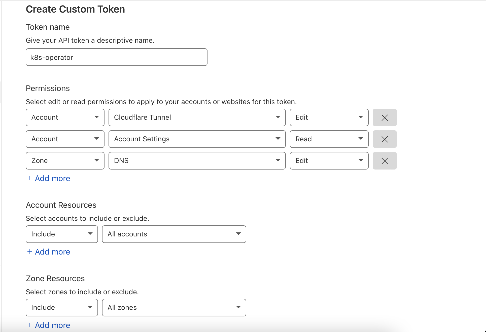

# Authenticating cloudflare-operator

For the operator to interact with the [Cloudflare API](https://api.cloudflare.com/), an API token or Key is needed.

These secrets are scoped to specific Tunnel/ClusterTunnel resources, so the operator can interact with multiple Tunnel/ClusterTunnel resources if you host several domains in one cluster.

In order to consume this API token, we will create a secret to be consumed by cloudflare-operator using the Tunnel/ClusterTunnel resource.

In order to minimise permissions granted to cloudflare-operator, it is recommended to use an API token.
Cloudflare-operator will use an API token _or_ API Key for each Tunnel/ClusterTunnel, never both.

> Optional: validation of tokens can be performed with [cloudflare_api.go](../internal/controllers/cloudflare_api.go).


## Steps

1. [Generate your API token as described below](#token-generation)
1. [Deploy the secret as described below](#secret-creation)

## Token generation

### API token (recommended)

These API tokens can be found under [My Profile > API tokens](https://dash.cloudflare.com/profile/api-tokens) page in the Cloudflare Dashboard.

For the `CLOUDFLARE_API_TOKEN`, create a new "custom" token with the following:

1. Permissions
   * Account > Cloudflare Tunnel > Edit : To create new tunnels
   * Account > Account Settings > Read : To get the accountId from Name and the domainId for the selected domain
   * Zone > DNS > Edit : To get the existing domain and create new entries in DNS for the domain.
1. Account Resources: Include > All accounts (or even better, the specific account(s) your zone(s) are in)
1. Zone Resources: Include > All zones (or even better, the specific zone(s) you want to manage)



### API Key (Here there be dragons)

> It is not recommended to use an API Key due to granting excess permissions. Use an API token instead.

For `CLOUDFLARE_API_KEY`, copy the Global API Key shown at the bottom of [Cloudflare's API token page](https://dash.cloudflare.com/profile/api-tokens).

## Secret creation

### Imperative

1. Run the following
   ```bash
   kubectl create secret generic cloudflare-secrets \
     --namespace cloudflare-operator-system \
     --from-literal CLOUDFLARE_API_TOKEN=<api-token> 
   ```

### Declarative

1. Replace `<api-token>` in `manifests/secret.yaml` with your cloudflare API token.
1. Deploy the secret
   ```bash
   kubectl apply -f manifests/secret.yaml
   ```
