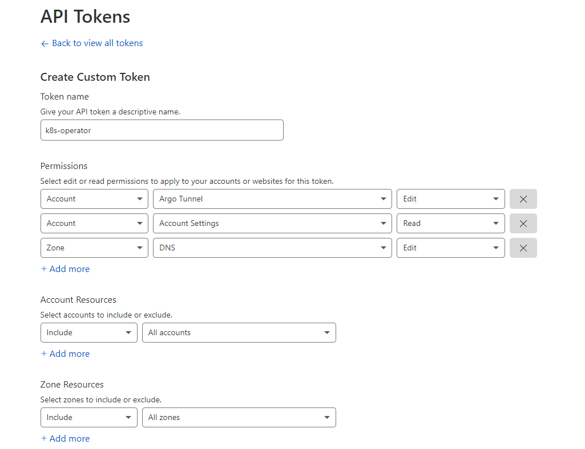

# Getting Started

## Cloudflare Tokens

For the operator to interact with the [Cloudflare API](https://api.cloudflare.com/), an API Token is needed. ~~To clean up and delete the DNS entries and the created tunnels, the Global API Key is needed.~~ This is no longer the case, all operations can be performed with an API Token. API Keys are still a valid form of authentication.

These API tokens can be found under [My Profile > API Tokens](https://dash.cloudflare.com/profile/api-tokens) page in the Cloudflare Dashboard.

For the `CLOUDFLARE_API_KEY`, copy the Global API Key shown at the bottom of the page.

For the `CLOUDFLARE_API_TOKEN`, create a new "custom" token with the following:

1. Permissions
    * Account > Cloudflare Tunnel > Edit : To create new tunnels
    * Account > Account Settings > Read : To get the accountId from Name and the domainId for the selected domain
    * Zone > DNS > Edit : To get the existing domain and create new entries in DNS for the domain. See [#5](/adyanth/cloudflare-operator/issues/5) for potential unintended consequences if not careful when creating Resources.
2. Account Resources: Include > All accounts
3. Zone Resources: Include > All zones



Usage of these tokens can be validated from the source code of [cloudflare_api.go](../internal/controllers/cloudflare_api.go).

## Prerequisites

To install this operator, you need the following:

* A kubernetes cluster with a recent enough version to support Custom Resource Definitions. The operator was initially built on `v1.22.5+k3s1` and being developed on `v1.25.4+k3s1`.
* [`kubectl` cli](https://kubernetes.io/docs/tasks/tools/#kubectl) for deploying the operator, custom resources and samples.

## Deploy the Operator

Deploy the operator using Kustomize:

```bash
kubectl apply -k https://github.com/adyanth/cloudflare-operator/config/default
# If you need more control on the version deployed, look at the below example
# Correct full format as per https://github.com/kubernetes-sigs/kustomize/blob/master/examples/remoteBuild.md
kubectl apply -k 'https://github.com/adyanth/cloudflare-operator.git//config/default?ref=main'
# If you need a specific version, follow the below syntax. Example shown for v0.4.1
kubectl apply -k 'https://github.com/adyanth/cloudflare-operator.git//config/default?ref=v0.12.0'
```

## Create a Custom ClusterTunnel Resource

To create a ClusterTunnel, we need to store Cloudflare credentials in a Secret. Follow the steps below. Have a look at the [detailed configuration guide](configuration.md) for more details.

1. Create a Secret containing Cloudflare credentials. More information on what these tokens do are [provided here](#cloudflare-tokens). We create the Secret in the operator namespace for using ClusterTunnels.

    ```bash
    kubectl -n cloudflare-operator-system create secret generic cloudflare-secrets --from-literal CLOUDFLARE_API_TOKEN=<api-token> --from-literal CLOUDFLARE_API_KEY=<api-key>
    ```

2. Create a ClusterTunnel Resource using `kubectl apply -f clustertunnel.yaml`.
    * The `newTunnel.name` is the name that shows up under Access > Tunnels on [Cloudflare For Teams Dashboard](https://dash.teams.cloudflare.com/)
    * The `cloudflare.email` is the email used to login to the dashboard. This is needed when using the Cloudflare Global API Key
    * The `cloudflare.domain` is the domain added and managed in Cloudflare under which new records are created
    * The `cloudflare.secret` is a reference to the Secret containing API keys and tokens. It should be in the same namespace as the Tunnel resource
    * The `accountId` is the one visible in the URL bar after logging into the [Cloudflare Dashboard](https://dash.cloudflare.com/). You can alternatively use `accountName` which is shown on the left panel once logged in.

    ```yaml
    # clustertunnel.yaml
    apiVersion: networking.cfargotunnel.com/v1alpha1
    kind: ClusterTunnel
    metadata:
      name: k3s-cluster-tunnel      # The ClusterTunnel Custom Resource Name
    spec:
      newTunnel:
        name: my-k8s-tunnel         # Name of your new tunnel on Cloudflare
      size: 2                       # This is the number of replicas for cloudflared
      cloudflare:
        email: email@example.com     # Your email used to login to the Cloudflare Dashboard
        domain: example.com         # Domain under which the tunnel runs and adds DNS entries to
        secret: cloudflare-secrets  # The secret created before
        # accountId and accountName cannot be both empty. If both are provided, Account ID is used if valid, else falls back to Account Name.
        accountName: <Cloudflare account name>
        accountId: <Cloudflare account ID>
    ```

3. Verify that the tunnel resource was successful and generated a configmap and a deployment.

    ```bash
    kubectl get clustertunnel k3s-cluster-tunnel -n cloudflare-operator-system
    kubectl get configmap k3s-cluster-tunnel -n cloudflare-operator-system
    kubectl get deployment k3s-cluster-tunnel -n cloudflare-operator-system
    ```

## Sample Deployment, Service and TunnelBinding to utilize the Tunnel

Deploy the below file using `kubectl apply -f sample.yaml` to run a [`whoami`](https://github.com/traefik/whoami) app and expose it to the internet using Cloudflare Tunnel.

The name of the service and the domain of the ClusterTunnel is used to add the DNS record. In this case, `whoami.example.com` and `whoami-2.example.com` would be added.

```yaml
# sample.yaml
apiVersion: apps/v1
kind: Deployment
metadata:
  name: whoami
spec:
  selector:
    matchLabels:
      app: whoami
  template:
    metadata:
      labels:
          app: whoami
    spec:
      containers:
        - name: whoami
          image: traefik/whoami
          resources:
            limits:
              memory: "128Mi"
              cpu: "500m"
          ports:
            - containerPort: 80
---
apiVersion: v1
kind: Service
metadata:
  name: whoami
spec:
  selector:
    app: whoami
  ports:
    - port: 80
      targetPort: 80
---
apiVersion: v1
kind: Service
metadata:
  name: whoami-2  # Sample service, points to the same deployment
spec:
  selector:
    app: whoami
  ports:
    - port: 80
      targetPort: 80
---
apiVersion: networking.cfargotunnel.com/v1alpha1
kind: TunnelBinding
metadata:
  name: whoami-cluster-tun
subjects:
  - name: whoami
  - name: whoami-2  # Points to the second service
tunnelRef:
  kind: ClusterTunnel
  name: k3s-cluster-tunnel
```

And that's it. Head over to `whoami.example.com` to see your deployment exposed securely through Cloudflare Tunnels!

## Deleting a tunnel

Remember the delete order while deleting the tunnel. If you delete the secrets before deleting the tunnel, the operator won't be able to clean up the tunnel from Cloudflare, since it no longer has the credentials for the same.
The correct order is to delete the tunnel, wait for it to actually get deleted (after the finalizer is removed) and then delete the secret.
