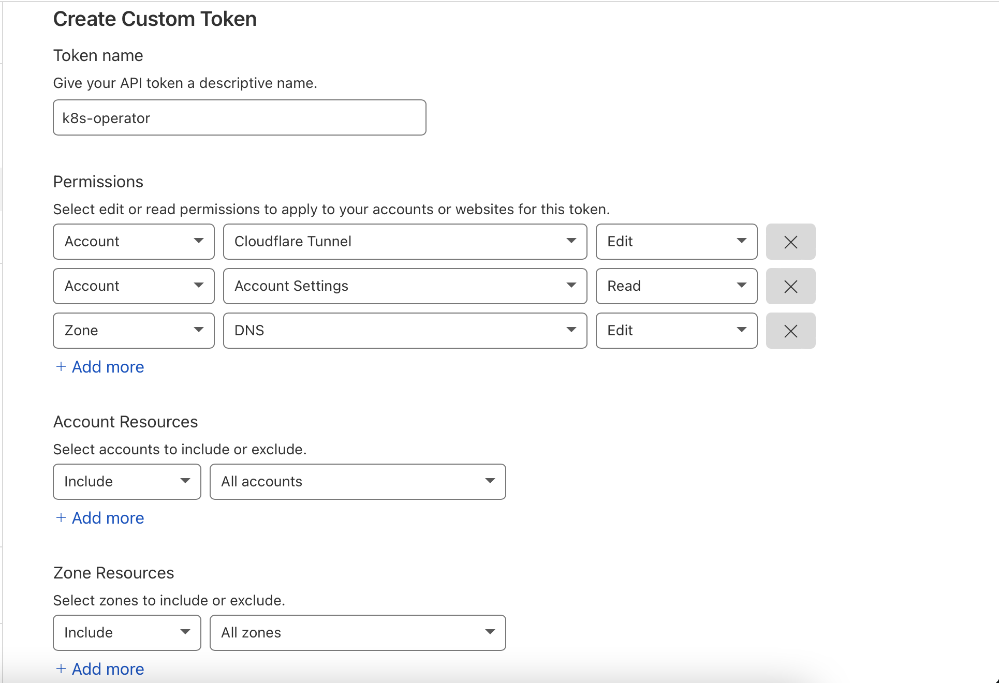

# Getting Started

## Cloudflare Tokens

For the operator to interact with the [Cloudflare API](https://api.cloudflare.com/), an API Token or Key is needed.
In order to minimise permissions granted to cloudflare-operator, it is recommended to use an API token.
Cloudflare-operator will use an API Token _or_ API Key, never both.

> Optional: Usage of these tokens can be validated from the source code of [cloudflare_api.go](../internal/controllers/cloudflare_api.go).

### API Token (recommended)

These API tokens can be found under [My Profile > API Tokens](https://dash.cloudflare.com/profile/api-tokens) page in the Cloudflare Dashboard.

For the `CLOUDFLARE_API_TOKEN`, create a new "custom" token with the following:

1. Permissions
    * Account > Cloudflare Tunnel > Edit : To create new tunnels
    * Account > Account Settings > Read : To get the accountId from Name and the domainId for the selected domain
    * Zone > DNS > Edit : To get the existing domain and create new entries in DNS for the domain. See [#5](/adyanth/cloudflare-operator/issues/5) for potential unintended consequences if not careful when creating Resources.
2. Account Resources: Include > All accounts (or even better, the specific account(s) your zone(s) are in)
3. Zone Resources: Include > All zones (or even better, the specific zone(s) you want to manage)



### API Key (Here there be dragons)

> It is not recommended to use an API Key due to granting excess permissions. Use an API token instead.

For `CLOUDFLARE_API_KEY`, copy the Global API Key shown at the bottom of [Cloudflare's API token page](https://dash.cloudflare.com/profile/api-tokens).

## Deploy the Operator

### Prerequisites

To install this operator, you need the following:

* A kubernetes cluster with a recent enough version to support Custom Resource Definitions. The operator was initially built on `v1.22.5+k3s1` and being developed on `v1.25.4+k3s1`.
* [`kubectl` cli](https://kubernetes.io/docs/tasks/tools/#kubectl) for deploying the operator, custom resources and samples.

Deploy the operator using Kustomize:

```bash
kubectl apply -k https://github.com/adyanth/cloudflare-operator/config/default
# If you need more control on the version deployed, look at the below example
# Correct full format as per https://github.com/kubernetes-sigs/kustomize/blob/master/examples/remoteBuild.md
kubectl apply -k 'https://github.com/adyanth/cloudflare-operator.git//config/default?ref=main'
# If you need a specific version, follow the below syntax. Example shown for v0.4.1
kubectl apply -k 'https://github.com/adyanth/cloudflare-operator.git//config/default?ref=v0.12.0'
```

## Examples

Several expected use cases are documented in the [examples directory](examples).

### Tunnel/ClusterTunnel

The following examples use a cluster tunnel, but a tunnel (which is namespaced) can be used interchangeably.

- [Using cloudflared to route to services (the normal method)](examples/tunnel-binding-simple)
- [Backing cloudflared with a reverse proxy](examples/tunnel-binding-with-reverse-proxy)


## Deletion

see [deletion.md](./deletion.md) for specific guidance on order of deletion for resources.
